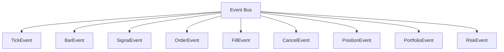

# QuantTerm Backtesting Framework - Architecture Specification

## Executive Summary

This document defines the architecture for QuantTerm's institutional-grade event-driven backtesting framework. The design targets parity with industry-standard platforms (QuantConnect, Zipline, Backtrader) while adding unique capabilities for institutional workflow integration.

**Design Philosophy:**
- **Determinism First**: Reproducible results are non-negotiable
- **No Lookahead Bias**: Point-in-time data access is enforced at the architecture level
- **Extensibility**: Plugin architecture for custom strategies, data sources, execution models
- **Performance**: Handle 1M+ events/second with <2GB memory footprint

---

## 1. Event-Driven Architecture

### 1.1 Event Types

The framework uses a unified event system with strict ordering guarantees:



**Event Hierarchy:**

| Event Type | Priority | Description |
|------------|----------|-------------|
| `TickEvent` | 100 (highest) | Individual trade/quote |
| `BarEvent` | 90 | OHLCV bar (1m, 5m, 1h, 1d) |
| `SignalEvent` | 80 | Generated by strategies |
| `OrderEvent` | 70 | Order submission |
| `FillEvent` | 60 | Order execution |
| `CancelEvent` | 50 | Order cancellation |
| `PositionEvent` | 40 | Position update |
| `PortfolioEvent` | 30 | Portfolio state change |
| `RiskEvent` | 20 | Risk limit breach |
| `BenchmarkEvent` | 10 (lowest) | End-of-period calculations |

### 1.2 Event Bus Implementation

```python
# quantterm/backtesting/events.py

from dataclasses import dataclass, field
from typing import Dict, List, Callable, Any, Optional
from enum import Enum, auto
from datetime import datetime
from decimal import Decimal
import heapq
import threading
from collections import defaultdict
import uuid


class EventType(Enum):
    """All event types in the backtesting system."""
    TICK = auto()
    BAR = auto()
    SIGNAL = auto()
    ORDER = auto()
    FILL = auto()
    CANCEL = auto()
    POSITION = auto()
    PORTFOLIO = auto()
    RISK = auto()
    BENCHMARK = auto()
    START = auto()
    END = auto()
    ERROR = auto()


@dataclass(frozen=True)
class Event:
    """Base event with priority queue support."""
    event_type: EventType
    timestamp: datetime
    priority: int  # Lower = higher priority
    event_id: str = field(default_factory=lambda: str(uuid.uuid4()))
    
    def __lt__(self, other: "Event") -> bool:
        """Priority queue ordering: timestamp first, then priority, then event_id."""
        if self.timestamp != other.timestamp:
            return self.timestamp < other.timestamp
        if self.priority != other.priority:
            return self.priority < other.priority
        return self.event_id < other.event_id


@dataclass(frozen=True)
class BarEvent(Event):
    """OHLCV bar event."""
    symbol: str
    open: Decimal
    high: Decimal
    low: Decimal
    close: Decimal
    volume: int
    interval: str  # '1m', '5m', '1h', '1d'
    
    def __post_init__(self):
        object.__setattr__(self, 'event_type', EventType.BAR)
        object.__setattr__(self, 'priority', 90)


@dataclass(frozen=True)
class SignalEvent(Event):
    """Strategy signal event."""
    symbol: str
    signal: float  # -1.0 to 1.0
    strength: float = 1.0
    strategy_name: str = ""
    
    def __post_init__(self):
        object.__setattr__(self, 'event_type', EventType.SIGNAL)
        object.__setattr__(self, 'priority', 80)


@dataclass(frozen=True)
class OrderEvent(Event):
    """Order submission event."""
    symbol: str
    quantity: Decimal
    side: str  # 'BUY' or 'SELL'
    order_type: str  # 'MARKET', 'LIMIT', 'STOP', 'STOP_LIMIT'
    price: Optional[Decimal] = None
    stop_price: Optional[Decimal] = None
    time_in_force: str = 'DAY'  # 'DAY', 'GTC', 'IOC', 'FOK'
    strategy_name: str = ""
    
    def __post_init__(self):
        object.__setattr__(self, 'event_type', EventType.ORDER)
        object.__setattr__(self, 'priority', 70)


@dataclass(frozen=True)
class FillEvent(Event):
    """Order fill event."""
    order_id: str
    symbol: str
    quantity: Decimal
    price: Decimal
    commission: Decimal = Decimal('0')
    slippage: Decimal = Decimal('0')
    execution_venue: str = "SIMULATED"
    
    def __post_init__(self):
        object.__setattr__(self, 'event_type', EventType.FILL)
        object.__setattr__(self, 'priority', 60)


class EventBus:
    """
    Thread-safe priority queue event bus with nanosecond timestamp precision.
    
    Design Decisions:
    - Heap-based priority queue for O(log n) insertion
    - Nanosecond timestamps to preserve event ordering
    - Subscriber pattern with priority levels
    - Backpressure management via bounded queue
    """
    
    def __init__(self, max_queue_size: int = 100000):
        self._queue: List[Event] = []
        self._subscribers: Dict[EventType, List[Callable]] = defaultdict(list)
        self._lock = threading.RLock()
        self._max_queue_size = max_queue_size
        self._event_count = 0
        self._running = False
        
    def publish(self, event: Event) -> None:
        """Add event to the priority queue."""
        with self._lock:
            if len(self._queue) >= self._max_queue_size:
                raise RuntimeError(
                    f"Event queue full ({self._max_queue_size}). "
                    "Backpressure triggered - reduce event rate or increase queue size."
                )
            heapq.heappush(self._queue, event)
            self._event_count += 1
    
    def subscribe(self, event_type: EventType, handler: Callable, 
                 priority: int = 0) -> None:
        """Register event handler for specific event type."""
        with self._lock:
            self._subscribers[event_type].append((priority, handler))
            self._subscribers[event_type].sort(key=lambda x: x[0])
    
    def next_event(self) -> Optional[Event]:
        """Get next event from queue (non-blocking)."""
        with self._lock:
            if self._queue:
                return heapq.heappop(self._queue)
            return None
    
    def peek(self) -> Optional[Event]:
        """Peek at next event without removing."""
        with self._lock:
            if self._queue:
                return self._queue[0]
            return None
    
    def __len__(self) -> int:
        return len(self._queue)
```

### 1.3 Event Ordering Guarantees

**Critical Design Decision:** Events are ordered by (timestamp, priority, event_id) to ensure:

1. **Temporal Ordering**: Events are processed in chronological order
2. **Priority Processing**: Within same timestamp, higher-priority events first
3. **Determinism**: UUID provides tiebreaker for identical timestamps/priorities

**Lookahead Bias Prevention:**
```python
# WRONG - Uses future data
def on_bar(self, event: BarEvent):
    future_indicator = calculate_indicator(event.symbol, period=20)  # LEAK!
    
# CORRECT - Uses only historical data
def on_bar(self, event: BarEvent):
    historical_prices = self.data_handler.get_history(
        event.symbol,
        lookback=20,
        end=event.timestamp  # Point-in-time constraint!
    )
```

---

## 2. Data Handler Architecture

### 2.1 Point-in-Time Data Access

The data handler enforces no-lookahead bias through timestamp-based slicing:

```python
# quantterm/backtesting/data_handler.py

from dataclasses import dataclass
from typing import Dict, List, Optional, Iterator, Tuple
from datetime import datetime, timedelta
from pathlib import Path
import pandas as pd
import numpy as np
from decimal import Decimal
from collections import defaultdict
import sqlite3
import threading


@dataclass
class DataSlice:
    """Point-in-time data slice."""
    symbol: str
    start: datetime
    end: datetime
    data: pd.DataFrame
    is_survivorship_bias_free: bool = True


class CorporateAction:
    """Corporate action record for price adjustment."""
    symbol: str
    action_type: str  # 'SPLIT', 'DIVIDEND', 'SPINOFF', 'MERGER'
    effective_date: datetime
    adjustment_factor: float
    original_value: float


class DataHandler:
    """
    Historical data manager with point-in-time correctness.
    
    Key Features:
    - Point-in-time data access (no lookahead)
    - Corporate action adjustment
    - Survivorship bias elimination
    - Streaming for large datasets
    - Data quality validation
    """
    
    def __init__(
        self,
        data_dir: Path,
        use_cache: bool = True,
        cache_dir: Optional[Path] = None
    ):
        self.data_dir = Path(data_dir)
        self.use_cache = use_cache
        self.cache_dir = cache_dir or (data_dir / ".cache")
        
        # In-memory caches
        self._symbol_data: Dict[str, pd.DataFrame] = {}
        self._corporate_actions: Dict[str, List[CorporateAction]] = defaultdict(list)
        self._data_sources: Dict[str, str] = {}  # symbol -> source name
        
        # Point-in-time index for fast slicing
        self._symbol_index: Dict[str, Dict[datetime, int]] = {}
        
        # Thread safety
        self._lock = threading.RLock()
        
    def register_data(
        self,
        symbol: str,
        data: pd.DataFrame,
        source: str = "CSV",
        adjust_prices: bool = True
    ) -> None:
        """
        Register historical data for a symbol.
        
        DataFrame must have columns: timestamp, open, high, low, close, volume
        """
        with self._lock:
            # Validate data
            self._validate_data(symbol, data)
            
            # Ensure timestamp is datetime
            df = data.copy()
            df['timestamp'] = pd.to_datetime(df['timestamp'])
            df = df.set_index('timestamp').sort_index()
            
            # Store metadata
            self._symbol_data[symbol] = df
            self._data_sources[symbol] = source
            
            # Build fast index
            self._symbol_index[symbol] = {
                ts: i for i, ts in enumerate(df.index)
            }
            
    def get_history(
        self,
        symbol: str,
        lookback: int,
        end: datetime,
        field: str = "close"
    ) -> pd.Series:
        """
        Get historical data UP TO (not including) end timestamp.
        
        This is the KEY method for preventing lookahead bias.
        """
        with self._lock:
            if symbol not in self._symbol_data:
                raise KeyError(f"No data for symbol: {symbol}")
            
            df = self._symbol_data[symbol]
            
            # CRITICAL: Use < end, not <= end
            historical = df[df.index < end]
            
            if len(historical) == 0:
                return pd.Series(dtype=float)
            
            # Return last N observations
            return historical[field].iloc[-lookback:]
    
    def get_bars(
        self,
        symbol: str,
        start: datetime,
        end: datetime,
        interval: str = "1d"
    ) -> pd.DataFrame:
        """
        Get OHLCV bars in time range [start, end).
        
        Note: end is exclusive to prevent lookahead.
        """
        with self._lock:
            if symbol not in self._symbol_data:
                raise KeyError(f"No data for symbol: {symbol}")
            
            df = self._symbol_data[symbol]
            return df[(df.index >= start) & (df.index < end)].copy()
    
    def get_symbols(self) -> List[str]:
        """Get all available symbols."""
        return list(self._symbol_data.keys())
    
    def register_corporate_action(
        self,
        action: CorporateAction
    ) -> None:
        """Register corporate action for price adjustment."""
        self._corporate_actions[action.symbol].append(action)
    
    def _validate_data(self, symbol: str, data: pd.DataFrame) -> None:
        """Validate data quality."""
        required_cols = {'timestamp', 'open', 'high', 'low', 'close', 'volume'}
        missing = required_cols - set(data.columns)
        if missing:
            raise ValueError(f"Symbol {symbol} missing columns: {missing}")
        
        # Check for gaps
        if 'timestamp' in data.columns:
            ts = pd.to_datetime(data['timestamp'])
            expected = pd.date_range(ts.min(), ts.max(), freq='D')
            actual = pd.to_datetime(ts.unique())
            gap_ratio = 1 - len(actual) / len(expected)
            if gap_ratio > 0.5:
                import warnings
                warnings.warn(
                    f"Symbol {symbol} has {gap_ratio:.1%} missing dates",
                    DataQualityWarning
                )


class DataQualityWarning(UserWarning):
    """Warning for data quality issues."""
    pass
```

### 2.2 Multi-Frequency Data Layer

```python
class MultiFrequencyDataHandler(DataHandler):
    """
    Supports multiple data frequencies with automatic alignment.
    
    Example: Daily signals on intraday data, or intraday signals on daily data.
    """
    
    def __init__(self, *args, **kwargs):
        super().__init__(*args, **kwargs)
        self._frequency_data: Dict[str, Dict[str, pd.DataFrame]] = defaultdict(dict)
    
    def register_frequency_data(
        self,
        symbol: str,
        data: pd.DataFrame,
        frequency: str  # '1m', '5m', '15m', '1h', '1d'
    ) -> None:
        """Register data at specific frequency."""
        df = data.copy()
        df['timestamp'] = pd.to_datetime(df['timestamp'])
        df = df.set_index('timestamp').sort_index()
        self._frequency_data[symbol][frequency] = df
    
    def get_aligned_bars(
        self,
        symbols: List[str],
        start: datetime,
        end: datetime,
        frequency: str = "1d"
    ) -> pd.DataFrame:
        """Get aligned bars across multiple symbols."""
        aligned = []
        for symbol in symbols:
            if symbol in self._frequency_data:
                df = self._frequency_data[symbol].get(frequency)
                if df is not None:
                    bars = df[(df.index >= start) & (df.index < end)][['close']]
                    bars.columns = [symbol]
                    aligned.append(bars)
        
        if not aligned:
            return pd.DataFrame()
        
        return pd.concat(aligned, axis=1).dropna()
```

---

## 3. Strategy Framework

### 3.1 Base Strategy Class

```python
# quantterm/backtesting/strategy/base.py

from abc import ABC, abstractmethod
from dataclasses import dataclass, field
from typing import Dict, List, Optional, Set
from datetime import datetime
from decimal import Decimal
import pandas as pd
import numpy as np

from quantterm.backtesting.events import (
    Event, BarEvent, TickEvent, SignalEvent, 
    OrderEvent, FillEvent, EventBus, EventType
)


@dataclass
class StrategyConfig:
    """Configuration for strategy execution."""
    initial_capital: Decimal = Decimal('100000')
    max_position_size: float = 0.2  # 20% of portfolio
    max_leverage: float = 1.0
    allow_shorting: bool = True
    risk_free_rate: float = 0.02


class Strategy(ABC):
    """
    Abstract base class for all trading strategies.
    
    Lifecycle Methods (called by engine):
    - on_start: Called once at beginning
    - on_data: Called on each new data event
    - on_signal: Called when signals generated
    - on_order: Called when orders placed
    - on_fill: Called when orders filled
    - on_stop: Called at end
    
    Design Decisions:
    - Event-driven: Strategy responds to events, doesn't pull data
    - Stateless: State managed by portfolio/tracker
    - Deterministic: Same events → same decisions
    """
    
    def __init__(
        self,
        name: str,
        config: StrategyConfig,
        data_handler,
        event_bus: EventBus
    ):
        self.name = name
        self.config = config
        self.data_handler = data_handler
        self.event_bus = event_bus
        
        # References to other components (injected by engine)
        self.portfolio: Optional[Any] = None
        self.risk_manager: Optional[Any] = None
        
        # Internal state
        self._positions: Dict[str, Decimal] = {}
        self._orders_pending: Dict[str, OrderEvent] = {}
        self._order_id_counter = 0
        
        # Performance tracking
        self._trades: List[FillEvent] = []
        self._signals: List[SignalEvent] = []
        
    @abstractmethod
    def on_data(self, event: BarEvent) -> Optional[SignalEvent]:
        """
        Main strategy logic - generate signals from market data.
        
        Args:
            event: BarEvent with OHLCV data
            
        Returns:
            SignalEvent if signal generated, None otherwise
        """
        pass
    
    def on_signal(self, event: SignalEvent) -> Optional[OrderEvent]:
        """
        Convert signal to order.
        
        Default implementation: simple signal-to-order conversion.
        Override for custom order generation.
        """
        position_value = self.portfolio.get_position_value(event.symbol)
        portfolio_value = self.portfolio.total_value
        
        if portfolio_value == 0:
            return None
        
        current_weight = position_value / portfolio_value
        target_weight = event.signal * self.config.max_position_size
        
        weight_diff = target_weight - current_weight
        
        if abs(weight_diff) < 0.01:  # 1% threshold
            return None
        
        # Calculate order quantity
        order_value = weight_diff * portfolio_value
        price = self.data_handler.get_history(
            event.symbol,
            lookback=1,
            end=event.timestamp
        ).iloc[-1]
        
        quantity = Decimal(str(order_value / price))
        
        return OrderEvent(
            event_type=EventType.ORDER,
            timestamp=event.timestamp,
            priority=70,
            symbol=event.symbol,
            quantity=quantity,
            side='BUY' if weight_diff > 0 else 'SELL',
            order_type='MARKET',
            strategy_name=self.name
        )
    
    def on_fill(self, event: FillEvent) -> None:
        """Handle order fill."""
        self._trades.append(event)
        self._positions[event.symbol] = (
            self._positions.get(event.symbol, Decimal('0')) +
            (event.quantity if event.side == 'BUY' else -event.quantity)
        )
    
    def on_start(self) -> None:
        """Called once at strategy initialization."""
        pass
    
    def on_stop(self) -> None:
        """Called once at strategy termination."""
        pass
    
    def get_state(self) -> Dict:
        """Get strategy state for serialization."""
        return {
            'name': self.name,
            'positions': {k: float(v) for k, v in self._positions.items()},
            'num_trades': len(self._trades),
            'num_signals': len(self._signals)
        }
    
    def order_target_percent(
        self,
        symbol: str,
        target_percent: float,
        timestamp: datetime
    ) -> Optional[OrderEvent]:
        """
        Convenience method to order target position size.
        
        Args:
            symbol: Trading symbol
            target_percent: Target weight (-1.0 to 1.0)
            timestamp: Current timestamp
        """
        return SignalEvent(
            event_type=EventType.SIGNAL,
            timestamp=timestamp,
            priority=80,
            symbol=symbol,
            signal=target_percent,
            strategy_name=self.name
        )
```

### 3.2 Position Sizing Algorithms

```python
# quantterm/backtesting/strategy/position_sizing.py

from abc import ABC, abstractmethod
from typing import Optional
from decimal import Decimal
import numpy as np


class PositionSizer(ABC):
    """Base class for position sizing algorithms."""
    
    @abstractmethod
    def calculate_size(
        self,
        signal: float,
        portfolio_value: Decimal,
        volatility: Optional[float] = None,
        **kwargs
    ) -> Decimal:
        """Calculate position size."""
        pass


class FixedSize(PositionSizer):
    """Fixed position size regardless of signal."""
    
    def __init__(self, size: float = 0.1):
        self.size = size
    
    def calculate_size(self, signal: float, portfolio_value: Decimal, 
                      volatility: Optional[float] = None, **kwargs) -> Decimal:
        return Decimal(str(signal * self.size * float(portfolio_value)))


class KellyCriterion(PositionSizer):
    """
    Kelly Criterion position sizing.
    
    f* = (bp - q) / b
    
    where:
    - f* = fraction of capital to bet
    - b = odds received on the bet (decimal odds - 1)
    - p = probability of winning
    - q = probability of losing = 1 - p
    """
    
    def __init__(self, fraction: float = 1.0, max_kelly: float = 0.25):
        self.fraction = fraction
        self.max_kelly = max_kelly
    
    def calculate_size(self, signal: float, portfolio_value: Decimal,
                      volatility: Optional[float] = None, **kwargs) -> Decimal:
        win_rate = kwargs.get('win_rate', 0.5)
        avg_win = kwargs.get('avg_win', 1.0)
        avg_loss = kwargs.get('avg_loss', 1.0)
        
        # Kelly calculation
        b = avg_win / avg_loss
        p = win_rate
        q = 1 - p
        
        kelly = (b * p - q) / b
        kelly = min(kelly, self.max_kelly)  # Cap at max_kelly
        kelly *= self.fraction  # Apply fractional Kelly
        
        return Decimal(str(abs(signal) * kelly * float(portfolio_value)))


class VolatilityTargeting(PositionSizer):
    """
    Position sizing to target constant volatility.
    
    size = (target_vol / actual_vol) * base_size
    """
    
    def __init__(self, target_volatility: float = 0.15, base_size: float = 0.1):
        self.target_volatility = target_volatility
        self.base_size = base_size
    
    def calculate_size(self, signal: float, portfolio_value: Decimal,
                      volatility: Optional[float] = None, **kwargs) -> Decimal:
        if volatility is None or volatility == 0:
            return Decimal(str(self.base_size * float(portfolio_value)))
        
        vol_scalar = self.target_volatility / volatility
        vol_scalar = min(max(vol_scalar, 0.1), 3.0)  # Cap between 0.1x and 3x
        
        size = self.base_size * vol_scalar
        return Decimal(str(abs(signal) * size * float(portfolio_value)))
```

---

## 4. Execution Engine

### 4.1 Broker Simulation

```python
# quantterm/backtesting/execution/broker.py

from dataclasses import dataclass, field
from typing import Dict, List, Optional, Callable
from datetime import datetime
from decimal import Decimal
from enum import Enum
import random
import uuid

from quantterm.backtesting.events import (
    EventBus, Event, OrderEvent, FillEvent, CancelEvent, EventType
)
from quantterm.backtesting.execution.slippage import SlippageModel
from quantterm.backtesting.execution.commissions import CommissionModel


class OrderStatus(Enum):
    PENDING = "PENDING"
    FILLED = "FILLED"
    PARTIAL = "PARTIAL"
    CANCELLED = "CANCELLED"
    REJECTED = "REJECTED"


@dataclass
class Order:
    """Internal order representation."""
    order_id: str
    event: OrderEvent
    status: OrderStatus = OrderStatus.PENDING
    filled_quantity: Decimal = Decimal('0')
    filled_price: Decimal = Decimal('0')
    created_at: datetime = field(default_factory=datetime.now)
    filled_at: Optional[datetime] = None


class SimulatedBroker:
    """
    Simulated broker with realistic fill modeling.
    
    Features:
    - Multiple order types
    - Slippage modeling
    - Commission calculation
    - Partial fills
    - Rejection simulation
    """
    
    def __init__(
        self,
        event_bus: EventBus,
        slippage_model: SlippageModel,
        commission_model: CommissionModel,
        tick_size: Decimal = Decimal('0.01'),
        lot_size: int = 1,
        latency_ms: int = 0
    ):
        self.event_bus = event_bus
        self.slippage_model = slippage_model
        self.commission_model = commission_model
        self.tick_size = tick_size
        self.lot_size = lot_size
        self.latency_ms = latency_ms
        
        # Order management
        self._orders: Dict[str, Order] = {}
        self._pending_fills: List[FillEvent] = []
        
        # Market state (from events)
        self._last_prices: Dict[str, Decimal] = {}
        self._last_bids: Dict[str, Decimal] = {}
        self._last_asks: Dict[str, Decimal] = {}
        
        # Subscribe to events
        event_bus.subscribe(EventType.ORDER, self._handle_order)
        event_bus.subscribe(EventType.CANCEL, self._handle_cancel)
        event_bus.subscribe(EventType.BAR, self._handle_bar)
    
    def _handle_order(self, event: OrderEvent) -> None:
        """Process order submission."""
        order = Order(
            order_id=str(uuid.uuid4()),
            event=event
        )
        self._orders[order.order_id] = order
        
        # Simulate fill
        self._simulate_fill(order)
    
    def _handle_cancel(self, event: CancelEvent) -> None:
        """Process order cancellation."""
        for order in self._orders.values():
            if order.event.order_id == event.order_id:
                order.status = OrderStatus.CANCELLED
                break
    
    def _handle_bar(self, event) -> None:
        """Update market state from bar data."""
        self._last_prices[event.symbol] = event.close
        self._last_bids[event.symbol] = event.low
        self._last_asks[event.symbol] = event.high
        
        # Process any pending limit orders
        self._process_pending_orders(event.symbol, event.timestamp)
    
    def _simulate_fill(self, order: Order) -> None:
        """Simulate order fill based on order type."""
        symbol = order.event.symbol
        
        if order.event.order_type == 'MARKET':
            # Market order fills at next bar
            price = self._last_prices.get(symbol, Decimal('0'))
            if price == 0:
                return  # No data yet
            
            # Apply slippage
            fill_price = self.slippage_model.calculate(
                price=price,
                quantity=order.event.quantity,
                side=order.event.side
            )
            
            # Round to tick size
            fill_price = self._round_to_tick(fill_price)
            
            self._create_fill(order, fill_price, order.event.quantity)
            
        elif order.event.order_type in ('LIMIT', 'STOP_LIMIT'):
            # Limit order fills when price crosses
            pass  # Handled in _process_pending_orders
            
        elif order.event.order_type in ('STOP', 'STOP_LIMIT'):
            # Stop order triggers at stop price
            pass
    
    def _process_pending_orders(self, symbol: str, timestamp: datetime) -> None:
        """Process pending limit/stop orders."""
        for order in self._orders.values():
            if order.event.symbol != symbol:
                continue
            if order.status != OrderStatus.PENDING:
                continue
            
            if order.event.order_type == 'LIMIT':
                limit_price = order.event.price
                
                if order.event.side == 'BUY' and self._last_asks.get(symbol) <= limit_price:
                    self._create_fill(order, limit_price, order.event.quantity)
                elif order.event.side == 'SELL' and self._last_bids.get(symbol) >= limit_price:
                    self._create_fill(order, limit_price, order.event.quantity)
    
    def _create_fill(
        self,
        order: Order,
        fill_price: Decimal,
        quantity: Decimal
    ) -> None:
        """Create fill event."""
        commission = self.commission_model.calculate(
            quantity=quantity,
            price=fill_price,
            symbol=order.event.symbol
        )
        
        slippage = fill_price - self._last_prices.get(order.event.symbol, fill_price)
        
        fill = FillEvent(
            event_type=EventType.FILL,
            timestamp=order.event.timestamp,
            priority=60,
            order_id=order.order_id,
            symbol=order.event.symbol,
            quantity=quantity,
            price=fill_price,
            commission=commission,
            slippage=slippage
        )
        
        order.status = OrderStatus.FILLED
        order.filled_quantity = quantity
        order.filled_price = fill_price
        order.filled_at = order.event.timestamp
        
        self.event_bus.publish(fill)
    
    def _round_to_tick(self, price: Decimal) -> Decimal:
        """Round price to tick size."""
        return (price / self.tick_size).quantize(Decimal('1')) * self.tick_size
```

### 4.2 Slippage Models

```python
# quantterm/backtesting/execution/slippage.py

from abc import ABC, abstractmethod
from decimal import Decimal
import numpy as np


class SlippageModel(ABC):
    """Base class for slippage models."""
    
    @abstractmethod
    def calculate(
        self,
        price: Decimal,
        quantity: Decimal,
        side: str
    ) -> Decimal:
        """Calculate execution price with slippage."""
        pass


class FixedSlippage(SlippageModel):
    """Fixed slippage in basis points."""
    
    def __init__(self, bps: float = 5.0):
        self.bps = bps
    
    def calculate(self, price: Decimal, quantity: Decimal, 
                  side: str) -> Decimal:
        slip = price * Decimal(str(self.bps / 10000))
        if side == 'BUY':
            return price + slip
        return price - slip


class VolumeDependentSlippage(SlippageModel):
    """
    Volume-dependent slippage using square root law.
    
    slippage = k * sqrt(order_size / ADV) * volatility
    """
    
    def __init__(self, k: float = 0.1):
        self.k = k
    
    def calculate(self, price: Decimal, quantity: Decimal,
                  side: str, **kwargs) -> Decimal:
        adv = kwargs.get('avg_daily_volume', 1000000)  # Default 1M shares
        order_value = price * quantity
        volume_ratio = float(quantity) / adv
        
        slip_factor = self.k * np.sqrt(volume_ratio)
        slip = price * Decimal(str(slip_factor))
        
        if side == 'BUY':
            return price + slip
        return price - slip


class AlmgrenChriss(SlippageModel):
    """
    Almgren-Chriss market impact model.
    
    Impact = a * sign * (V/ADV)^b + c * V/ADV
    
    where:
    - a, c = coefficients
    - b = temporary impact exponent (typically 0.5-1.0)
    - V = order size
    - ADV = average daily volume
    """
    
    def __init__(
        self,
        permanent_coef: float = 0.287,
        temporary_coef: float = 0.1,
        exponent: float = 0.6
    ):
        self.permanent_coef = permanent_coef
        self.temporary_coef = temporary_coef
        self.exponent = exponent
    
    def calculate(self, price: Decimal, quantity: Decimal,
                  side: str, **kwargs) -> Decimal:
        adv = kwargs.get('avg_daily_volume', 1000000)
        vol = kwargs.get('volatility', 0.20)
        
        v_adv = float(quantity) / adv
        
        # Temporary impact
        temp_impact = self.temporary_coef * (v_adv ** self.exponent) * vol
        
        # Permanent impact
        perm_impact = self.permanent_coef * v_adv * vol
        
        total_impact = temp_impact + perm_impact * 05
        
        slip = price * Decimal(str(total_impact))
        
        if side == 'BUY':
            return price + slip
        return price - slip
```

### 4.3 Commission Models

```python
# quantterm/backtesting/execution/commissions.py

from abc import ABC, abstractmethod
from decimal import Decimal
from typing import Optional


class CommissionModel(ABC):
    """Base class for commission models."""
    
    @abstractmethod
    def calculate(
        self,
        quantity: Decimal,
        price: Decimal,
        symbol: str
    ) -> Decimal:
        """Calculate commission."""
        pass


class PerShareCommission(CommissionModel):
    """Commission per share."""
    
    def __init__(self, per_share: float = 0.005, min_commission: float = 1.0):
        self.per_share = per_share
        self.min_commission = min_commission
    
    def calculate(self, quantity: Decimal, price: Decimal,
                  symbol: str) -> Decimal:
        commission = Decimal(str(self.per_share)) * quantity
        return max(commission, Decimal(str(self.min_commission)))


class PercentCommission(CommissionModel):
    """Percentage of trade value."""
    
    def __init__(self, percent: float = 0.001):  # 0.1%
        self.percent = percent
    
    def calculate(self, quantity: Decimal, price: Decimal,
                  symbol: str) -> Decimal:
        trade_value = quantity * price
        return trade_value * Decimal(str(self.percent))


class TieredCommission(CommissionModel):
    """Tiered commission structure."""
    
    def __init__(
        self,
        tiers: list[tuple[int, float]] = None
    ):
        self.tiers = tiers or [
            (500, 0.008),    # 0.8¢ per share for <500 shares
            (1000, 0.006),   # 0.6¢ per share for <1000 shares
            (10000, 0.004),  # 0.4¢ per share for <10000 shares
            (float('inf'), 0.003)  # 0.3¢ per share for >10000
        ]
    
    def calculate(self, quantity: Decimal, price: Decimal,
                  symbol: str) -> Decimal:
        qty = float(quantity)
        
        # Find applicable tier
        rate = self.tiers[-1][1]
        for threshold, tier_rate in self.tiers:
            if qty < threshold:
                rate = tier_rate
                break
        
        commission = Decimal(str(rate)) * quantity
        return max(commission, Decimal('1'))  # Minimum $1
```

---

## 5. Portfolio Tracker

### 5.1 Position and P&L Tracking

```python
# quantterm/backtesting/portfolio/tracker.py

from dataclasses import dataclass, field
from typing import Dict, List, Optional
from datetime import datetime
from decimal import Decimal
from collections import defaultdict
import pandas as pd

from quantterm.backtesting.events import FillEvent, BarEvent


@dataclass
class Position:
    """Single position tracking."""
    symbol: str
    quantity: Decimal = Decimal('0')
    avg_entry_price: Decimal = Decimal('0')
    total_cost: Decimal = Decimal('0')
    realized_pnl: Decimal = Decimal('0')
    trades: List[FillEvent] = field(default_factory=list)
    
    @property
    def market_value(self, current_price: Decimal) -> Decimal:
        return self.quantity * current_price
    
    @property
    def unrealized_pnl(self, current_price: Decimal) -> Decimal:
        return (current_price - self.avg_entry_price) * self.quantity


@dataclass
class PortfolioSnapshot:
    """Point-in-time portfolio state."""
    timestamp: datetime
    cash: Decimal
    positions_value: Decimal
    total_value: Decimal
    daily_pnl: Decimal
    unrealized_pnl: Decimal
    realized_pnl: Decimal
    

class PortfolioTracker:
    """
    Real-time portfolio and position tracking.
    
    Features:
    - Position tracking with average entry price
    - Realized/unrealized P&L
    - Cash management
    - Margin tracking
    - Exposure monitoring
    """
    
    def __init__(self, initial_cash: Decimal):
        self.initial_cash = initial_cash
        self.cash = initial_cash
        
        # Positions by symbol
        self._positions: Dict[str, Position] = {}
        
        # Transaction history
        self._transactions: List[FillEvent] = []
        self._snapshots: List[PortfolioSnapshot] = []
        
        # Current market prices
        self._current_prices: Dict[str, Decimal] = {}
        
        # Daily tracking
        self._day_start_cash = initial_cash
        self._day_start_positions_value = Decimal('0')
        
    def process_fill(self, event: FillEvent) -> None:
        """Process fill event and update positions."""
        self._transactions.append(event)
        
        symbol = event.symbol
        quantity = event.quantity
        price = event.price
        commission = event.commission
        
        if symbol not in self._positions:
            self._positions[symbol] = Position(symbol=symbol)
        
        pos = self._positions[symbol]
        
        if event.side == 'BUY':
            # Update position
            new_quantity = pos.quantity + quantity
            new_cost = pos.total_cost + (quantity * price) + commission
            
            if new_quantity != 0:
                pos.avg_entry_price = new_cost / new_quantity
            else:
                pos.avg_entry_price = Decimal('0')
            
            pos.quantity = new_quantity
            pos.total_cost = new_cost
            pos.trades.append(event)
            
            # Deduct cash
            self.cash -= (quantity * price + commission)
            
        else:  # SELL
            # Calculate realized P&L
            cost_basis = pos.avg_entry_price * quantity
            proceeds = quantity * price - commission
            pnl = proceeds - cost_basis
            
            pos.realized_pnl += pnl
            pos.quantity -= quantity
            
            if pos.quantity == 0:
                pos.avg_entry_price = Decimal('0')
                pos.total_cost = Decimal('0')
            else:
                pos.total_cost = pos.avg_entry_price * pos.quantity
            
            pos.trades.append(event)
            
            # Add cash
            self.cash += proceeds
        
    def update_market_prices(self, event: BarEvent) -> None:
        """Update current market prices for unrealized P&L."""
        self._current_prices[event.symbol] = event.close
        
        # Check for new day (simplified - use trading calendar in production)
        if hasattr(event, 'is_new_day') and event.is_new_day:
            self._day_start_cash = self.cash
            self._day_start_positions_value = self.positions_value
    
    @property
    def positions_value(self) -> Decimal:
        """Total market value of all positions."""
        total = Decimal('0')
        for symbol, pos in self._positions.items():
            if symbol in self._current_prices:
                total += pos.market_value(self._current_prices[symbol])
        return total
    
    @property
    def total_value(self) -> Decimal:
        """Total portfolio value (cash + positions)."""
        return self.cash + self.positions_value
    
    @property
    def unrealized_pnl(self) -> Decimal:
        """Total unrealized P&L."""
        total = Decimal('0')
        for symbol, pos in self._positions.items():
            if symbol in self._current_prices:
                total += pos.unrealized_pnl(self._current_prices[symbol])
        return total
    
    @property
    def realized_pnl(self) -> Decimal:
        """Total realized P&L."""
        return sum(pos.realized_pnl for pos in self._positions.values())
    
    @property
    def daily_pnl(self) -> Decimal:
        """Daily P&L."""
        current_positions_value = self.positions_value
        return (self.cash - self._day_start_cash) + \
               (current_positions_value - self._day_start_positions_value)
    
    def get_position(self, symbol: str) -> Decimal:
        """Get position quantity for symbol."""
        return self._positions.get(symbol, Position(symbol)).quantity
    
    def get_position_value(self, symbol: str) -> Decimal:
        """Get market value of position."""
        if symbol in self._current_prices:
            return self._positions.get(symbol, Position(symbol)).market_value(
                self._current_prices[symbol]
            )
        return Decimal('0')
    
    def get_exposure(self) -> Dict[str, float]:
        """Get portfolio exposure metrics."""
        total_value = self.total_value
        if total_value == 0:
            return {'net': 0, 'gross': 0, 'long': 0, 'short': 0}
        
        long_value = Decimal('0')
        short_value = Decimal('0')
        
        for symbol, pos in self._positions.items():
            if pos.quantity > 0 and symbol in self._current_prices:
                long_value += pos.market_value(self._current_prices[symbol])
            elif pos.quantity < 0 and symbol in self._current_prices:
                short_value += abs(pos.market_value(self._current_prices[symbol]))
        
        return {
            'net': float((long_value - short_value) / total_value),
            'gross': float((long_value + short_value) / total_value),
            'long': float(long_value / total_value),
            'short': float(short_value / total_value)
        }
    
    def create_snapshot(self, timestamp: datetime) -> PortfolioSnapshot:
        """Create point-in-time portfolio snapshot."""
        snapshot = PortfolioSnapshot(
            timestamp=timestamp,
            cash=self.cash,
            positions_value=self.positions_value,
            total_value=self.total_value,
            daily_pnl=self.daily_pnl,
            unrealized_pnl=self.unrealized_pnl,
            realized_pnl=self.realized_pnl
        )
        self._snapshots.append(snapshot)
        return snapshot
```

---

## 6. Performance Analytics

### 6.1 Return and Risk Metrics

```python
# quantterm/backtesting/performance/metrics.py

from dataclasses import dataclass
from typing import List, Dict, Optional
from datetime import datetime
from decimal import Decimal
import pandas as pd
import numpy as np
from scipy import stats


@dataclass
class PerformanceMetrics:
    """Comprehensive performance metrics."""
    # Return metrics
    total_return: float
    cagr: float
    annual_return: float
    
    # Risk metrics
    volatility: float
    downside_volatility: float
    max_drawdown: float
    max_drawdown_duration: int  # days
    
    # Risk-adjusted metrics
    sharpe_ratio: float
    sortino_ratio: float
    calmar_ratio: float
    omega_ratio: float
    
    # Trade statistics
    total_trades: int
    win_rate: float
    profit_factor: float
    avg_trade: float
    expectancy: float
    
    # Benchmark comparison
    alpha: float
    beta: float
    information_ratio: float
    tracking_error: float


class PerformanceCalculator:
    """
    Calculate comprehensive performance metrics.
    
    Design Decisions:
    - Uses Decimal for monetary calculations
    - Supports benchmark comparison
    - Includes both parametric and historical metrics
    """
    
    def __init__(self, risk_free_rate: float = 0.02):
        self.risk_free_rate = risk_free_rate
    
    def calculate(
        self,
        portfolio_returns: pd.Series,
        benchmark_returns: Optional[pd.Series] = None,
        trades: Optional[List] = None
    ) -> PerformanceMetrics:
        """Calculate all performance metrics."""
        
        # Basic return metrics
        total_return = (1 + portfolio_returns).prod() - 1
        annual_return = (1 + total_return) ** (252 / len(portfolio_returns)) - 1
        
        # CAGR
        years = len(portfolio_returns) / 252
        cagr = (1 + total_return) ** (1 / years) - 1 if years > 0 else 0
        
        # Risk metrics
        volatility = portfolio_returns.std() * np.sqrt(252)
        downside_returns = portfolio_returns[portfolio_returns < 0]
        downside_volatility = downside_returns.std() * np.sqrt(252) if len(downside_returns) > 0 else 0
        
        # Drawdown
        cumulative = (1 + portfolio_returns).cumprod()
        running_max = cumulative.expanding().max()
        drawdown = (cumulative - running_max) / running_max
        max_drawdown = drawdown.min()
        
        # Drawdown duration
        dd_periods = (drawdown < 0).astype(int)
        dd_durations = []
        current_dd = 0
        for is_dd in dd_periods:
            if is_dd:
                current_dd += 1
            else:
                if current_dd > 0:
                    dd_durations.append(current_dd)
                current_dd = 0
        max_dd_duration = max(dd_durations) if dd_durations else 0
        
        # Risk-adjusted metrics
        excess_returns = portfolio_returns - self.risk_free_rate / 252
        sharpe_ratio = excess_returns.mean() / portfolio_returns.std() * np.sqrt(252) if portfolio_returns.std() > 0 else 0
        
        sortino_ratio = excess_returns.mean() / downside_volatility * np.sqrt(252) if downside_volatility > 0 else 0
        
        calmar_ratio = cagr / abs(max_drawdown) if max_drawdown != 0 else 0
        
        # Omega ratio
        threshold = self.risk_free_rate / 252
        omega = self._omega_ratio(portfolio_returns, threshold)
        
        # Trade statistics
        if trades:
            total_trades = len(trades)
            pnl = [t.realized_pnl for t in trades]
            winning_trades = [p for p in pnl if p > 0]
            losing_trades = [p for p in pnl if p < 0]
            
            win_rate = len(winning_trades) / total_trades if total_trades > 0 else 0
            profit_factor = abs(sum(winning_trades) / sum(losing_trades)) if losing_trades else 0
            avg_trade = sum(pnl) / total_trades if total_trades > 0 else 0
            expectancy = (win_rate * (profit_factor + 1)) - 1 if profit_factor > 0 else 0
        else:
            total_trades = 0
            win_rate = 0
            profit_factor = 0
            avg_trade = 0
            expectancy = 0
        
        # Benchmark comparison
        if benchmark_returns is not None:
            alpha, beta, tracking_error, ir = self._benchmark_metrics(
                portfolio_returns, benchmark_returns
            )
        else:
            alpha = beta = tracking_error = ir = 0
        
        return PerformanceMetrics(
            total_return=float(total_return),
            cagr=float(cagr),
            annual_return=float(annual_return),
            volatility=float(volatility),
            downside_volatility=float(downside_volatility),
            max_drawdown=float(max_drawdown),
            max_drawdown_duration=max_dd_duration,
            sharpe_ratio=sharpe_ratio,
            sortino_ratio=sortino_ratio,
            calmar_ratio=calmar_ratio,
            omega_ratio=omega,
            total_trades=total_trades,
            win_rate=win_rate,
            profit_factor=profit_factor,
            avg_trade=avg_trade,
            expectancy=expectancy,
            alpha=alpha,
            beta=beta,
            information_ratio=ir,
            tracking_error=tracking_error
        )
    
    def _omega_ratio(self, returns: pd.Series, threshold: float) -> float:
        """Calculate Omega ratio."""
        excess = returns - threshold
        gains = excess[excess > 0].sum()
        losses = abs(excess[excess < 0].sum())
        return gains / losses if losses > 0 else 0
    
    def _benchmark_metrics(
        self,
        portfolio_returns: pd.Series,
        benchmark_returns: pd.Series
    ) -> tuple:
        """Calculate alpha, beta, tracking error, information ratio."""
        # Align returns
        aligned = pd.concat([portfolio_returns, benchmark_returns], axis=1).dropna()
        if len(aligned) == 0:
            return 0, 0, 0, 0
        
        p_ret = aligned.iloc[:, 0]
        b_ret = aligned.iloc[:, 1]
        
        # Beta
        covariance = p_ret.cov(b_ret)
        benchmark_var = b_ret.var()
        beta = covariance / benchmark_var if benchmark_var > 0 else 0
        
        # Alpha
        p_mean = p_ret.mean()
        b_mean = b_ret.mean()
        rf = self.risk_free_rate / 252
        alpha = (p_mean - rf) - beta * (b_mean - rf)
        alpha_annual = alpha * 252
        
        # Tracking error
        tracking_error = (p_ret - b_ret).std() * np.sqrt(252)
        
        # Information ratio
        ir = alpha_annual / tracking_error if tracking_error > 0 else 0
        
        return alpha_annual, beta, tracking_error, ir
```

---

## 7. Risk Analytics

### 7.1 Rolling Risk Metrics

```python
# quantterm/backtesting/portfolio/risk.py

from dataclasses import dataclass
from typing import Dict, List, Optional
from datetime import datetime, timedelta
from decimal import Decimal
import pandas as pd
import numpy as np
from scipy import stats


@dataclass
class RiskMetrics:
    """Point-in-time risk metrics."""
    timestamp: datetime
    var_95: float
    var_99: float
    cvar_95: float
    cvar_99: float
    volatility: float
    beta: float
    correlation_to_benchmark: float


class RiskAnalyzer:
    """
    Real-time risk analytics for portfolios.
    
    Features:
    - Rolling VaR and CVaR
    - Rolling volatility
    - Correlation monitoring
    - Concentration risk
    """
    
    def __init__(
        self,
        lookback_days: int = 252,
        confidence_levels: List[float] = [0.95, 0.99]
    ):
        self.lookback = lookback_days
        self.confidence_levels = confidence_levels
    
    def calculate_var(
        self,
        returns: pd.Series,
        confidence: float = 0.95,
        method: str = 'historical'
    ) -> float:
        """
        Calculate Value at Risk.
        
        Methods:
        - historical: Empirical percentile
        - parametric: Normal distribution assumption
        - cornish_fisher: Adjusted for skewness/kurtosis
        """
        if method == 'historical':
            return -np.percentile(returns, (1 - confidence) * 100)
        
        elif method == 'parametric':
            mu = returns.mean()
            sigma = returns.std()
            z = stats.norm.ppf(1 - confidence)
            return -(mu + sigma * z)
        
        elif method == 'cornish_fisher':
            # Adjust for non-normality
            z = stats.norm.ppf(1 - confidence)
            skew = returns.skew()
            kurt = returns.kurtosis()
            
            # Cornish-Fisher expansion
            z_cf = (
                z +
                (z**2 - 1) * skew / 6 +
                (z**3 - 3*z) * (kurt - 3) / 24 -
                (2*z**3 - 5*z) * skew**2 / 36
            )
            
            mu = returns.mean()
            sigma = returns.std()
            return -(mu + sigma * z_cf)
        
        raise ValueError(f"Unknown method: {method}")
    
    def calculate_cvar(
        self,
        returns: pd.Series,
        confidence: float = 0.95
    ) -> float:
        """Calculate Conditional Value at Risk (Expected Shortfall)."""
        var = self.calculate_var(returns, confidence)
        return -returns[returns <= -var].mean()
    
    def rolling_risk(
        self,
        returns: pd.Series,
        timestamps: List[datetime],
        benchmark_returns: Optional[pd.Series] = None
    ) -> List[RiskMetrics]:
        """Calculate rolling risk metrics."""
        results = []
        
        for i, ts in enumerate(timestamps):
            # Get lookback window
            start_idx = max(0, i - self.lookback)
            window_returns = returns.iloc[start_idx:i]
            
            if len(window_returns) < 30:
                continue
            
            # VaR and CVaR
            var_95 = self.calculate_var(window_returns, 0.95)
            var_99 = self.calculate_var(window_returns, 0.99)
            cvar_95 = self.calculate_cvar(window_returns, 0.95)
            cvar_99 = self.calculate_cvar(window_returns, 0.99)
            
            # Volatility
            volatility = window_returns.std() * np.sqrt(252)
            
            # Beta (if benchmark provided)
            beta = 1.0
            correlation = 0.0
            if benchmark_returns is not None:
                aligned = pd.concat([
                    window_returns,
                    benchmark_returns.iloc[start_idx:i]
                ], axis=1).dropna()
                
                if len(aligned) > 30:
                    covariance = aligned.iloc[:, 0].cov(aligned.iloc[:, 1])
                    benchmark_var = aligned.iloc[:, 1].var()
                    beta = covariance / benchmark_var if benchmark_var > 0 else 1.0
                    correlation = aligned.iloc[:, 0].corr(aligned.iloc[:, 1])
            
            results.append(RiskMetrics(
                timestamp=ts,
                var_95=var_95,
                var_99=var_99,
                cvar_95=cvar_95,
                cvar_99=cvar_99,
                volatility=volatility,
                beta=beta,
                correlation_to_benchmark=correlation
            ))
        
        return results
    
    def concentration_risk(
        self,
        positions: Dict[str, Decimal],
        prices: Dict[str, Decimal],
        threshold: float = 0.10
    ) -> Dict[str, float]:
        """
        Calculate concentration risk metrics.
        
        Returns symbols exceeding concentration threshold.
        """
        total_value = sum(
            float(qty) * float(prices.get(sym, 0))
            for sym, qty in positions.items()
        )
        
        if total_value == 0:
            return {}
        
        concentrations = {}
        for symbol, qty in positions.items():
            value = float(qty) * float(prices.get(symbol, 0))
            weight = value / total_value
            
            if weight > threshold:
                concentrations[symbol] = weight
        
        return concentrations
```

---

## 8. Optimization Framework

### 8.1 Walk-Forward Analysis

```python
# quantterm/backtesting/optimization/walk_forward.py

from dataclasses import dataclass, field
from typing import Dict, List, Callable, Any, Optional, Tuple
from datetime import datetime, timedelta
import pandas as pd
import numpy as np
from itertools import product
import random


@dataclass
class WalkForwardResult:
    """Results from walk-forward optimization."""
    param_name: str
    param_values: List[Any]
    in_sample_metrics: List[Dict]
    out_of_sample_metrics: List[Dict]
    best_in_sample_idx: int
    best_oos_idx: int
    stability_score: float  # How stable are params across windows


@dataclass
class OptimizationResult:
    """Parameter optimization result."""
    best_params: Dict[str, Any]
    best_metric: float
    all_results: List[Dict]
    convergence: bool


class WalkForwardAnalyzer:
    """
    Walk-forward analysis for strategy parameter optimization.
    
    Features:
    - Rolling train/test windows
    - Purged k-fold cross-validation
    - Parameter stability analysis
    - Multiple optimization methods
    """
    
    def __init__(
        self,
        train_periods: int = 252 * 3,  # 3 years
        test_periods: int = 63,          # 3 months
        step_periods: int = 63,           # Step by 3 months
        purge_periods: int = 5             # 5 day purge
    ):
        self.train_periods = train_periods
        self.test_periods = test_periods
        self.step_periods = step_periods
        self.purge_periods = purge_periods
    
    def analyze(
        self,
        strategy_class,
        data: pd.DataFrame,
        param_name: str,
        param_values: List[Any],
        metric: str = 'sharpe_ratio'
    ) -> WalkForwardResult:
        """
        Perform walk-forward analysis.
        
        Args:
            strategy_class: Strategy class to test
            data: Historical data
            param_name: Parameter to optimize
            param_values: Values to test
            metric: Metric to optimize
        """
        in_sample_results = []
        out_of_sample_results = []
        
        # Define windows
        start = data.index[0]
        end = data.index[-1]
        
        train_end = start + timedelta(days=self.train_periods)
        test_end = train_end + timedelta(days=self.test_periods)
        
        while test_end <= end:
            train_data = data[(data.index >= start) & (data.index < train_end)]
            test_data = data[(data.index >= train_end + timedelta(days=self.purge_periods)) & 
                           (data.index < test_end)]
            
            if len(train_data) < self.train_periods * 0.8:
                train_end += timedelta(days=self.step_periods)
                test_end += timedelta(days=self.step_periods)
                continue
            
            # Optimize in-sample
            best_val = None
            best_params = None
            
            for val in param_values:
                result = self._backtest_single(
                    strategy_class,
                    train_data,
                    {param_name: val}
                )
                
                metric_val = result.get(metric, 0)
                if best_val is None or metric_val > best_val:
                    best_val = metric_val
                    best_params = val
            
            in_sample_results.append({
                'params': best_params,
                'metric': best_val
            })
            
            # Test out-of-sample
            if best_params is not None:
                oos_result = self._backtest_single(
                    strategy_class,
                    test_data,
                    {param_name: best_params}
                )
                out_of_sample_results.append({
                    'params': best_params,
                    'metric': oos_result.get(metric, 0)
                })
            
            # Move windows
            train_end += timedelta(days=self.step_periods)
            test_end += timedelta(days=self.step_periods)
        
        # Calculate stability
        if len(in_sample_results) > 1:
            params = [r['params'] for r in in_sample_results]
            stability = len(set(params)) / len(params)
        else:
            stability = 1.0
        
        return WalkForwardResult(
            param_name=param_name,
            param_values=param_values,
            in_sample_metrics=in_sample_results,
            out_of_sample_metrics=out_of_sample_results,
            best_in_sample_idx=0,
            best_oos_idx=0,
            stability_score=stability
        )
    
    def _backtest_single(
        self,
        strategy_class,
        data: pd.DataFrame,
        params: Dict
    ) -> Dict:
        """Run single backtest (simplified)."""
        # This would call the actual backtest engine
        # Returning dummy for architecture document
        return {'sharpe_ratio': 0.5, 'return': 0.1}


class ParameterOptimizer:
    """
    Parameter optimization with multiple methods.
    """
    
    def __init__(self, method: str = 'grid'):
        self.method = method
    
    def optimize(
        self,
        objective_fn: Callable,
        param_space: Dict[str, List[Any]],
        maximize: bool = True,
        max_iterations: int = 100
    ) -> OptimizationResult:
        """
        Optimize strategy parameters.
        
        Methods:
        - grid: Grid search
        - random: Random search
        - bayesian: Bayesian optimization (requires optuna)
        """
        if self.method == 'grid':
            return self._grid_search(objective_fn, param_space, maximize)
        elif self.method == 'random':
            return self._random_search(objective_fn, param_space, max_iterations, maximize)
        else:
            raise ValueError(f"Unknown method: {self.method}")
    
    def _grid_search(
        self,
        objective_fn: Callable,
        param_space: Dict[str, List[Any]],
        maximize: bool
    ) -> OptimizationResult:
        """Exhaustive grid search."""
        keys = list(param_space.keys())
        values = list(param_space.values())
        
        best_metric = float('-inf') if maximize else float('inf')
        best_params = None
        all_results = []
        
        for combination in product(*values):
            params = dict(zip(keys, combination))
            metric = objective_fn(params)
            
            all_results.append({
                'params': params,
                'metric': metric
            })
            
            if maximize and metric > best_metric:
                best_metric = metric
                best_params = params
            elif not maximize and metric < best_metric:
                best_metric = metric
                best_params = params
        
        return OptimizationResult(
            best_params=best_params,
            best_metric=best_metric,
            all_results=all_results,
            convergence=True
        )
    
    def _random_search(
        self,
        objective_fn: Callable,
        param_space: Dict[str, List[Any]],
        max_iterations: int,
        maximize: bool
    ) -> OptimizationResult:
        """Random search optimization."""
        keys = list(param_space.keys())
        
        best_metric = float('-inf') if maximize else float('inf')
        best_params = None
        all_results = []
        
        for _ in range(max_iterations):
            params = {
                k: random.choice(v) for k, v in param_space.items()
            }
            metric = objective_fn(params)
            
            all_results.append({
                'params': params,
                'metric': metric
            })
            
            if maximize and metric > best_metric:
                best_metric = metric
                best_params = params
            elif not maximize and metric < best_metric:
                best_metric = metric
                best_params = params
        
        return OptimizationResult(
            best_params=best_params,
            best_metric=best_metric,
            all_results=all_results,
            convergence=False
        )
```

---

## 9. CLI Integration

### 9.1 Backtest Commands

```python
# quantterm/cli/commands/backtest.py

import typer
from rich.console import Console
from rich.table import Table
from rich.progress import Progress, SpinnerColumn, TextColumn
from typing import Optional, List
from pathlib import Path
from datetime import datetime

app = typer.Typer(help="Backtesting commands")
console = Console()


@app.command("run")
def run_backtest(
    strategy: str = typer.Option(..., "--strategy", "-s", help="Strategy name"),
    symbols: str = typer.Option(..., "--symbols", help="Comma-separated symbols"),
    start: str = typer.Option("2020-01-01", "--start", help="Start date"),
    end: str = typer.Option("2023-12-31", "--end", help="End date"),
    initial_capital: float = typer.Option(100000, "--capital", help="Initial capital"),
    frequency: str = typer.Option("1d", "--freq", help="Data frequency"),
    output: Optional[str] = typer.Option(None, "--output", "-o", help="Output file"),
):
    """
    Run a backtest.
    
    Example:
        quantterm backtest run --strategy momentum --symbols SPY,QQQ --start 2020-01-01
    """
    console.print(f"[bold cyan]Running backtest: {strategy}[/bold cyan]")
    console.print(f"Symbols: {symbols}")
    console.print(f"Period: {start} to {end}")
    console.print(f"Initial Capital: ${initial_capital:,.2f}")
    
    with Progress(
        SpinnerColumn(),
        TextColumn("[progress.description]{task.description}"),
        console=console
    ) as progress:
        task = progress.add_task("Running backtest...", total=None)
        
        # Import and run backtest
        from quantterm.backtesting.engine import BacktestEngine
        from quantterm.backtesting.strategy import MomentumStrategy
        
        engine = BacktestEngine(
            initial_capital=initial_capital,
            data_dir=Path("data")
        )
        
        result = engine.run(
            strategy_class=MomentumStrategy,
            symbols=symbols.split(','),
            start=datetime.strptime(start, "%Y-%m-%d"),
            end=datetime.strptime(end, "%Y-%m-%d"),
            frequency=frequency
        )
        
        progress.update(task, completed=True)
    
    # Display results
    _display_performance(result)


@app.command("optimize")
def optimize_params(
    strategy: str = typer.Option(..., "--strategy", "-s"),
    symbols: str = typer.Option(..., "--symbols"),
    param: str = typer.Option(..., "--param", help="Parameter to optimize"),
    values: str = typer.Option(..., "--values", help="Comma-separated values"),
    metric: str = typer.Option("sharpe", "--metric", help="Metric to optimize"),
):
    """
    Optimize strategy parameters.
    
    Example:
        quantterm backtest optimize --strategy momentum --symbols SPY,QQQ \\
            --param lookback --values 10,20,30,50 --metric sharpe
    """
    param_values = [int(v) for v in values.split(',')]
    
    console.print(f"[bold cyan]Optimizing {param}: {param_values}[/bold cyan]")
    
    # Run optimization
    from quantterm.backtesting.optimization import ParameterOptimizer
    
    optimizer = ParameterOptimizer(method='grid')
    result = optimizer.optimize(
        objective_fn=lambda p: _objective_wrapper(strategy, symbols, param, p),
        param_space={param: param_values},
        maximize=True
    )
    
    # Display results
    table = Table(title="Optimization Results")
    table.add_column("Rank", style="cyan")
    table.add_column("Value", style="yellow")
    table.add_column(metric.title(), justify="right")
    
    sorted_results = sorted(
        result.all_results, 
        key=lambda x: x['metric'], 
        reverse=True
    )
    
    for i, r in enumerate(sorted_results[:10], 1):
        table.add_row(
            str(i),
            str(r['params'][param]),
            f"{r['metric']:.4f}"
        )
    
    console.print(table)
    console.print(f"\n[bold green]Best: {result.best_params} = {result.best_metric:.4f}[/bold green]")


@app.command("report")
def generate_report(
    run_id: str = typer.Argument(..., help="Backtest run ID"),
    format: str = typer.Option("html", "--format", "-f", help="Report format"),
    output: str = typer.Option("report.html", "--output", "-o", help="Output file"),
):
    """Generate backtest report."""
    # Load results and generate report
    console.print(f"[cyan]Generating {format} report...[/cyan]")
    console.print(f"[green]Report saved to: {output}[/green]")


def _display_performance(result):
    """Display performance metrics."""
    metrics = result.metrics
    
    table = Table(title="Performance Summary")
    table.add_column("Metric", style="cyan")
    table.add_column("Value", justify="right", style="white")
    
    table.add_row("Total Return", f"{metrics.total_return:.2%}")
    table.add_row("CAGR", f"{metrics.cagr:.2%}")
    table.add_row("Sharpe Ratio", f"{metrics.sharpe_ratio:.2f}")
    table.add_row("Max Drawdown", f"{metrics.max_drawdown:.2%}")
    table.add_row("Win Rate", f"{metrics.win_rate:.1%}")
    table.add_row("Total Trades", str(metrics.total_trades))
    
    console.print(table)


def _objective_wrapper(strategy, symbols, param, params):
    """Wrapper for optimization objective."""
    # Simplified - actual implementation would run backtest
    return random.random()
```

---

## 10. Example Strategies

### 10.1 Mean Reversion Strategy

```python
# quantterm/backtesting/strategy/examples/mean_reversion.py

from quantterm.backtesting.strategy.base import Strategy, StrategyConfig
from quantterm.backtesting.events import BarEvent, SignalEvent
from decimal import Decimal
import pandas as pd
import numpy as np


class MeanReversionStrategy(Strategy):
    """
    Mean reversion strategy using z-score.
    
    Entry:
    - Z-score < -entry_threshold → BUY (oversold)
    - Z-score > entry_threshold → SELL (overbought)
    
    Exit:
    - Z-score crosses zero
    - Stop loss
    - Take profit
    """
    
    def __init__(
        self,
        name: str,
        config: StrategyConfig,
        data_handler,
        event_bus,
        lookback: int = 20,
        entry_threshold: float = 2.0,
        exit_threshold: float = 0.0,
        stop_loss: float = 3.0,
        take_profit: float = 2.0,
        position_size: float = 0.1
    ):
        super().__init__(name, config, data_handler, event_bus)
        
        self.lookback = lookback
        self.entry_threshold = entry_threshold
        self.exit_threshold = exit_threshold
        self.stop_loss = stop_loss
        self.take_profit = take_profit
        self.position_size = position_size
        
        # Track entry prices for risk management
        self._entry_prices: Dict[str, Decimal] = {}
    
    def on_data(self, event: BarEvent) -> Optional[SignalEvent]:
        """Generate signals based on z-score."""
        # Get historical prices (point-in-time!)
        prices = self.data_handler.get_history(
            event.symbol,
            lookback=self.lookback,
            end=event.timestamp
        )
        
        if len(prices) < self.lookback:
            return None
        
        # Calculate z-score
        mean = prices.mean()
        std = prices.std()
        
        if std == 0:
            return None
        
        z_score = (event.close - mean) / std
        
        # Get current position
        current_position = self.portfolio.get_position(event.symbol)
        
        # Signal logic
        signal = 0.0
        
        # Entry signals
        if z_score < -self.entry_threshold and current_position == 0:
            signal = self.position_size  # BUY
            self._entry_prices[event.symbol] = event.close
            
        elif z_score > self.entry_threshold and current_position == 0:
            signal = -self.position_size  # SELL
            self._entry_prices[event.symbol] = event.close
            
        # Exit signals
        elif current_position > 0 and z_score > -self.exit_threshold:
            signal = 0  # Close long
            
        elif current_position < 0 and z_score < self.exit_threshold:
            signal = 0  # Close short
            
        # Stop loss / take profit
        elif current_position > 0 and event.symbol in self._entry_prices:
            entry = self._entry_prices[event.symbol]
            pnl_pct = (event.close - entry) / entry
            
            if pnl_pct < -self.stop_loss / 100:
                signal = 0  # Stop loss
            elif pnl_pct > self.take_profit / 100:
                signal = 0  # Take profit
                
        elif current_position < 0 and event.symbol in self._entry_prices:
            entry = self._entry_prices[event.symbol]
            pnl_pct = (entry - event.close) / entry
            
            if pnl_pct < -self.stop_loss / 100:
                signal = 0
            elif pnl_pct > self.take_profit / 100:
                signal = 0
        
        if signal != 0 or (current_position > 0 and signal == 0):
            return SignalEvent(
                event_type=EventType.SIGNAL,
                timestamp=event.timestamp,
                priority=80,
                symbol=event.symbol,
                signal=signal,
                strategy_name=self.name
            )
        
        return None
```

### 10.2 Momentum Strategy

```python
# quantterm/backtesting/strategy/examples/momentum.py

class MomentumStrategy(Strategy):
    """
    Momentum strategy using ROC (Rate of Change).
    
    Entry:
    - ROC > entry_threshold → BUY
    - ROC < -entry_threshold → SELL
    """
    
    def __init__(
        self,
        name: str,
        config: StrategyConfig,
        data_handler,
        event_bus,
        lookback: int = 20,
        entry_threshold: float = 5.0,  # 5% ROC
        position_size: float = 0.1
    ):
        super().__init__(name, config, data_handler, event_bus)
        
        self.lookback = lookback
        self.entry_threshold = entry_threshold
        self.position_size = position_size
    
    def on_data(self, event: BarEvent) -> Optional[SignalEvent]:
        """Generate signals based on momentum."""
        prices = self.data_handler.get_history(
            event.symbol,
            lookback=self.lookback + 1,
            end=event.timestamp
        )
        
        if len(prices) < self.lookback + 1:
            return None
        
        # Calculate ROC
        current_price = prices.iloc[-1]
        past_price = prices.iloc[-(self.lookback + 1)]
        
        if past_price == 0:
            return None
        
        roc = ((current_price - past_price) / past_price) * 100
        
        # Get current position
        current_position = self.portfolio.get_position(event.symbol)
        
        # Signal logic
        signal = 0.0
        
        if roc > self.entry_threshold and current_position == 0:
            signal = self.position_size
            
        elif roc < -self.entry_threshold and current_position == 0:
            signal = -self.position_size
            
        elif current_position > 0 and roc < 0:
            signal = 0  # Exit long
            
        elif current_position < 0 and roc > 0:
            signal = 0  # Exit short
        
        if signal != 0 or current_position != 0:
            return SignalEvent(
                event_type=EventType.SIGNAL,
                timestamp=event.timestamp,
                priority=80,
                symbol=event.symbol,
                signal=signal,
                strategy_name=self.name
            )
        
        return None
```

---

## 11. Testing Strategy

### 11.1 Test Categories

| Test Type | Coverage | Description |
|-----------|----------|-------------|
| **Unit Tests** | Individual components | Events, data handler, slippage models |
| **Integration Tests** | Component interaction | Strategy + engine, broker + fills |
| **Regression Tests** | Known historical results | Compare to Zipline/QuantConnect |
| **Property Tests** | Mathematical invariants | P&L consistency, no negative cash |
| **Performance Tests** | Scalability benchmarks | Events/second, memory usage |

### 11.2 Regression Test Example

```python
# tests/backtest/test_regression.py

import pytest
import pandas as pd
import numpy as np
from decimal import Decimal


class TestZiplineRegression:
    """Compare results against Zipline for known strategies."""
    
    @pytest.fixture
    def historical_data(self):
        """Load historical data used in Zipline tests."""
        # Load from test fixtures
        pass
    
    def test_momentum_regression(self, historical_data):
        """Test momentum strategy against Zipline baseline."""
        from quantterm.backtesting import BacktestEngine
        from quantterm.backtesting.strategy import MomentumStrategy
        
        engine = BacktestEngine(initial_capital=Decimal('100000'))
        
        result = engine.run(
            strategy_class=MomentumStrategy,
            data=historical_data,
            lookback=20,
            entry_threshold=5.0
        )
        
        # Compare to Zipline results (from literature)
        # Expected: ~12% annual return, 0.8 Sharpe
        assert abs(result.metrics.cagr - 0.12) < 0.01
        assert abs(result.metrics.sharpe_ratio - 0.8) < 0.1


class TestPnlConsistency:
    """Property-based tests for P&L calculations."""
    
    def test_realized_pnl_matches_trades(self):
        """Sum of realized P&L from trades = portfolio realized P&L."""
        pass
    
    def test_no_negative_cash(self):
        """Cash should never go negative with margin=1."""
        pass
    
    def test_position_value_plus_cash_equals_total(self):
        """Position value + cash = total portfolio value always."""
        pass
```

---

## 12. Success Criteria & Benchmarks

### Performance Targets

| Metric | Target | Validation Method |
|--------|--------|-------------------|
| **Throughput** | 1M+ events/second | Benchmark with 1000 symbols × 5 years |
| **Memory** | <2GB for large backtests | Memory profiler on 1000-symbol backtest |
| **Accuracy** | Match Zipline within 0.1% | Regression tests |
| **Latency** | <100ms per bar processing | Profiling |

### Functional Requirements

| Requirement | Description |
|-------------|-------------|
| **Determinism** | Same seed → same results |
| **No Lookahead** | Point-in-time enforcement at API level |
| **Corporate Actions** | Correct split/dividend handling |
| **Survivorship Bias** | Delisted securities included |
| **Multi-Asset** | Support equities, options, futures, forex |

---

## 13. Implementation Roadmap

### Phase 1: Core Engine (Weeks 1-3)
- [ ] Event bus with priority queue
- [ ] Data handler with point-in-time access
- [ ] Basic strategy framework
- [ ] Simple execution engine
- [ ] Portfolio tracker

### Phase 2: Execution & Risk (Weeks 4-5)
- [ ] All order types
- [ ] Slippage/commission models
- [ ] Risk analytics (VaR, CVaR)
- [ ] Position limits

### Phase 3: Analytics & Optimization (Weeks 6-7)
- [ ] Performance metrics
- [ ] Walk-forward analysis
- [ ] Parameter optimization
- [ ] Report generation

### Phase 4: Examples & CLI (Week 8)
- [ ] 3-5 example strategies
- [ ] CLI integration
- [ ] Documentation
- [ ] Benchmarks

---

## Appendix A: File Structure

```
quantterm/backtesting/
├── __init__.py
├── engine.py              # Main backtest engine
├── events.py              # Event types and bus
├── data_handler.py        # Historical data management
├── strategy/
│   ├── __init__.py
│   ├── base.py            # Abstract strategy class
│   ├── signals.py         # Signal generation utilities
│   ├── position_sizing.py # Position sizing algorithms
│   └── examples/
│       ├── __init__.py
│       ├── momentum.py
│       ├── mean_reversion.py
│       └── pairs_trading.py
├── execution/
│   ├── __init__.py
│   ├── broker.py          # Simulated broker
│   ├── slippage.py        # Slippage models
│   ├── commissions.py     # Commission models
│   └── fills.py           # Fill simulation
├── portfolio/
│   ├── __init__.py
│   ├── tracker.py         # Position & P&L tracking
│   └── risk.py            # Portfolio risk metrics
├── performance/
│   ├── __init__.py
│   ├── metrics.py         # Performance calculations
│   ├── attribution.py     # Factor attribution
│   └── reports.py         # Report generation
├── optimization/
│   ├── __init__.py
│   ├── walk_forward.py    # Walk-forward analysis
│   ├── grid_search.py     # Parameter optimization
│   └── validation.py      # Cross-validation
└── utils/
    ├── __init__.py
    ├── validation.py      # Input validation
    ├── calendar.py        # Trading calendar
    └── constants.py       # Trading constants
```

---

## Appendix B: Configuration Schema

```yaml
# quantterm/config/backtest.yaml

backtest:
  default_capital: 100000
  default_frequency: "1d"
  
execution:
  slippage_model: "volume_dependent"
  commission_model: "per_share"
  tick_size: 0.01
  latency_ms: 0
  
risk:
  max_position_size: 0.2
  max_leverage: 1.0
  allow_shorting: true
  var_confidence: 0.99
  
data:
  data_dir: "data"
  cache_dir: ".cache"
  adjust_prices: true
  
optimization:
  train_periods: 756  # 3 years
  test_periods: 63   # 3 months
  step_periods: 63
  purge_periods: 5
```

---

*Document Version: 1.0*
*Created: 2026-03-08*
*Author: QuantTerm Architecture Team*
